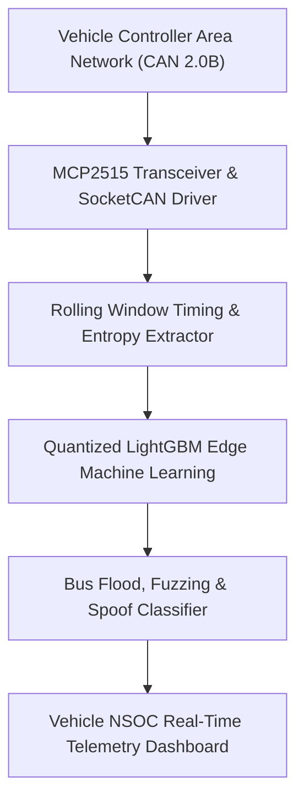

# 🛡️ EdgeGuard — Offline Edge-AI Intrusion Detection System for Automotive CAN Networks
### *Standalone Embedded Machine Learning Pipeline & NSOC Portal for Zero-Day Vehicle Cyberattack Detection*

    

  <a href="https://github.com/Tharun4743/EdgeGuard">📦 <b>Official GitHub Repository</b></a>
  
  

---

## 1. 📌 Problem Statement & Context
Connected vehicles and autonomous driving platforms communicate internally via Controller Area Network (CAN) bus protocols, introducing critical cybersecurity vulnerabilities:

* 🔓 **Zero Inherent Encryption or Authentication:** CAN messages contain no cryptographic signatures or sender verification. Any compromised ECU (or rogue OBD-II dongle) can broadcast arbitrary commands.
* 🚗 **Catastrophic Physical Hijacking Risks:** Attackers injecting forged CAN frames can remotely override steering systems, kill engine acceleration, or disable braking mechanisms at highway speeds.
* ⏱️ **Sub-Millisecond Attack Dynamics:** Vehicle bus floods (Denial-of-Service) overwhelm vehicle microcontrollers within milliseconds, making cloud-based detection unviable.
* 📴 **Cellular Dead Zone Vulnerability:** Vehicles frequently travel through tunnels and remote rural highways where cloud security monitoring is completely unreachable.

---

## 2. 🔍 Existing Solutions & Critical Gaps
| Automotive Defense Metric | Legacy In-Vehicle Gateways | Cloud Telematics Security | 🛡️ EdgeGuard On-Device IDS |
| :--- | :---: | :---: | :---: |
| **Detection Latency** | ⚠️ Rule Checks (10–50ms) | ❌ High Cloud Lag (>2000ms) | ✅ Sub-5ms Real-Time Edge Inference |
| **Zero-Day Anomaly Detection**| ❌ Static Filter Rules Only | ⚠️ Cloud Analytics Only | ✅ Quantized Machine Learning (LightGBM) |
| **Offline Tunnel Operation** | ✅ Offline (Rigid Rules) | ❌ Complete Security Blackout | ✅ 100% Offline Edge Intelligence |
| **Message Timing & Entropy Check**| ❌ None | ⚠️ Aggregated Metrics | ✅ Microsecond Inter-Arrival Telemetry |
| **NSOC Real-Time Visualizer** | ❌ None | ⚠️ Delayed Batch Reports | ✅ Live WebSocket Telemetry Dashboard |

### ⚠️ Critical Limitations of Existing Alternatives:
* 🚫 **Bypassable Static Firewalls:** Simple whitelist firewalls fail when attackers inject malicious payloads using legitimate arbitration IDs.
* 🛑 **Dangerous Cloud Dependency:** Routing vehicular CAN packets to cloud servers introduces unacceptable latency that could result in fatal crashes.
* 📴 **Absence of Forensic Visualizers:** Vehicle maintenance teams lack intuitive tools to inspect historical bus flood anomalies after an attack occurs.

---

## 3. 💡 Proposed Solution & Architectural Innovation
**EdgeGuard** is an edge-native automotive intrusion detection system (IDS) and Network Security Operations Center (NSOC) visualizer engineered for **automotive CAN networks**:

* 🛡️ **Sub-5ms Edge ML Inference:** Lightweight, quantized anomaly detection pipeline (LightGBM) executing directly on embedded vehicle microcontrollers (Raspberry Pi / ECUs).
* ⏱️ **Microsecond Message Frequency Analysis:** Continuously evaluates arbitration ID inter-arrival timing, byte-level payload entropy, and cyclic transmission regularity to identify DoS floods, fuzzing, and impersonation attacks.
* 🔒 **100% Offline Operational Independence:** Protects vehicle passengers completely without requiring internet access or cloud telematics connections.
* 📊 **Automotive NSOC Diagnostic Visualizer:** Real-time dashboard rendering live CAN bus message velocity, anomaly threat scores, and compromised ECU arbitration IDs.
* 🚗 **Seamless OBD-II / CAN Transceiver Interfacing:** Designed to interface directly with physical vehicle buses via SocketCAN and MCP2515 hardware transceivers.

---

## 4. ⚙️ Technical Approach & System Architecture

### 📐 High-Level Architectural Flowchart:

| Security Pipeline | Technologies Used | Functional Capability |
| :--- | :--- | :--- |
| **Bus Sniffer & Adapter** | Python `can` library, SocketCAN, MCP2515 | Intercepts raw CAN 2.0B frames from vehicle OBD-II diagnostic ports |
| **Feature Extraction Engine** | NumPy, Rolling Window Processor | Extracts inter-frame arrival deltas, payload entropy, and arbitration frequency |
| **Quantized Edge ML Model** | LightGBM, Scikit-Learn | Evaluates feature vectors in sub-5ms cycles with low memory consumption |
| **NSOC Telemetry Portal** | React, WebSockets, Tailwind CSS | Displays live vehicle bus utilization, alert logs, and flagged ECUs |

### 🔄 End-to-End Operational Lifecycle Workflow:

1. **Frame Ingestion:** Hardware transceiver taps into CAN bus → Ingests high-frequency arbitration frames at 500 kbps.
2. **Feature Extraction:** Rolling window processor computes time deltas and byte entropy between sequential messages.
3. **Edge Anomaly Scoring:** Quantized LightGBM model evaluates incoming vectors → Flags unauthorized message injection in under 5ms → Triggers NSOC visual alert.

---

## 5. 📈 Quantifiable Impact & Measurable Benefits
* ⏱️ **Sub-Millisecond Threat Detection:** Detects bus flood attacks before physical vehicle actuators can be compromised.
* 🔒 **100% Offline Edge Operation:** Protects vehicles completely without requiring internet or cloud connectivity.
* 🛡️ **Critical Automotive Defense:** Protects driver and passenger lives from remote vehicle takeover attacks.
* 🚗 **Standardized CAN Compatibility:** Operates across standard automotive CAN 2.0B protocols without altering factory ECU firmware.

---

## 6. 🚀 Feasibility, Operational Viability & Scalability
* 🔬 **Technical Feasibility:** Designed to interface directly with standard OBD-II ports and automotive CAN transceivers (MCP2515).
* 💰 **Economic & Financial Viability:** Low-cost edge deployment allows vehicle manufacturers to integrate IDS security for a fraction of current telematics costs.
* 🏛️ **Operational Governance:** Passive bus sniffing introduces zero electrical or latency interference to critical vehicle braking and steering systems.
* 📈 **Horizontal Scalability Roadmap:** Easily deployable across commercial automotive fleets, electric vehicles, and autonomous test platforms.

---

## 7. 👨‍💻 Author & Intellectual Property License

### Lead Architect & Author
**Tharunkumar K** ([@Tharun4743](https://github.com/Tharun4743))
* 🎓 B.Tech Information Technology • V.S.B. Engineering College, Karur
* 🌐 [GitHub Profile](https://github.com/Tharun4743) • [LinkedIn](https://linkedin.com/in/tharunkumark4743) • [Personal Portfolio](https://tharunkumark4743.netlify.app)

### 🔒 Proprietary License Notice (All Rights Reserved)
> [!CAUTION]
> **PROPRIETARY & CONFIDENTIAL INTELLECTUAL PROPERTY**
> 
> All rights reserved. This repository, its architecture, source code, workflows, firmware, and associated documentation are the exclusive intellectual property of **Tharunkumar K**.
> 
> **No entity, organization, or individual is permitted to copy, modify, distribute, publish, commercially exploit, reverse engineer, or deploy any portion of this project without express, prior written permission from the author.**
> 
> **Copyright © 2026 Tharunkumar K. All Rights Reserved.**
